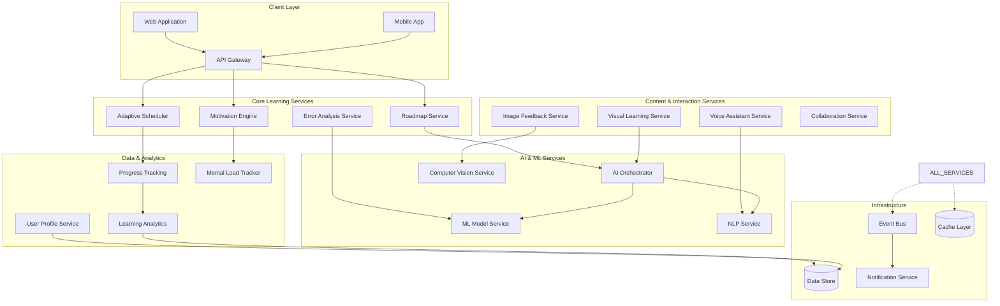
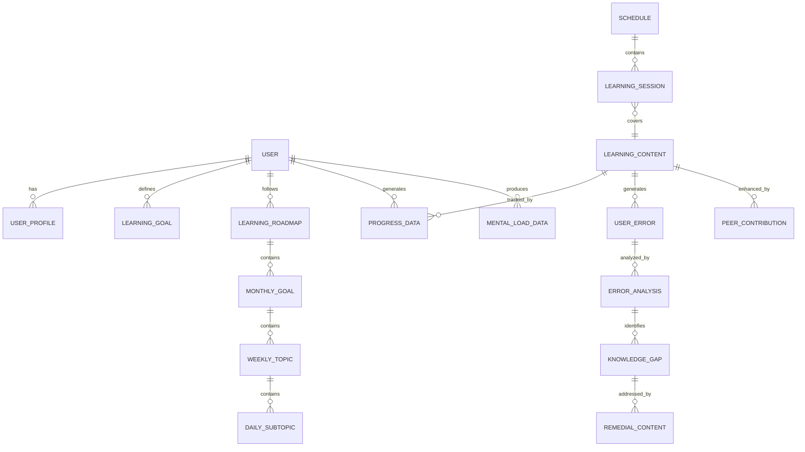

# Design Document: Synapse AI-Powered Adaptive Learning Platform

## Overview

Synapse is an AI-powered adaptive learning platform designed to provide personalized, context-aware learning experiences. The system combines intelligent content generation, adaptive scheduling, motivation management, and multi-modal learning support to help users learn faster, smarter, and more consistently.

The platform addresses core learning challenges through five key architectural pillars:
1. **AI-Driven Personalization**: Dynamic content and path generation based on individual learning patterns
2. **Adaptive Intelligence**: Real-time adjustment of schedules, difficulty, and content based on progress and context
3. **Context-Aware Motivation**: Non-intrusive motivation system that prioritizes completion over initiation
4. **Multi-Modal Learning**: Support for visual, auditory, and kinesthetic learning preferences
5. **Scalable Architecture**: Microservices-based design supporting millions of concurrent learners

## Architecture

### High-Level Architecture

The system follows a microservices architecture pattern with event-driven communication, enabling independent scaling and deployment of components. The architecture is designed around the principle of "learning-first" where all services are optimized for educational effectiveness rather than generic productivity.



### Service Boundaries

**Learning Core Services**:
- **Roadmap Service**: Generates and manages personalized learning paths
- **Adaptive Scheduler**: Handles time-based and target-based scheduling with real-time adaptation
- **Motivation Engine**: Provides context-aware motivation and accountability
- **Error Analysis Service**: Processes mistakes and updates learning paths

**Content Services**:
- **Visual Learning Service**: Generates mind maps, concept flows, and visual summaries
- **Voice Assistant Service**: Handles voice interactions and audio explanations
- **Image Feedback Service**: Processes uploaded handwritten work and diagrams
- **Collaboration Service**: Manages peer interactions and content improvements

**AI/ML Services**:
- **AI Orchestrator**: Coordinates AI operations across services
- **ML Model Service**: Hosts and manages machine learning models
- **NLP Service**: Handles natural language processing tasks
- **Computer Vision Service**: Processes images and visual content

## Components and Interfaces

### Core Learning Components

#### Roadmap Service
**Responsibilities**:
- Generate structured learning roadmaps with monthly/weekly/daily breakdown
- Coordinate multiple concurrent learning paths
- Update roadmaps based on progress and error analysis
- Validate learning progression logic

**Key Interfaces**:
```typescript
interface RoadmapService {
  generateRoadmap(goal: LearningGoal, userProfile: UserProfile): Promise<LearningRoadmap>
  updateRoadmap(roadmapId: string, progressData: ProgressData): Promise<LearningRoadmap>
  validateProgression(roadmap: LearningRoadmap): ValidationResult
  coordinateMultipleRoadmaps(roadmaps: LearningRoadmap[]): CoordinationResult
}

interface LearningRoadmap {
  id: string
  userId: string
  goal: LearningGoal
  monthlyGoals: MonthlyGoal[]
  weeklyTopics: WeeklyTopic[]
  dailySubtopics: DailySubtopic[]
  estimatedTimeRequirements: TimeEstimate
  lastUpdated: Date
}
```

#### Adaptive Scheduler
**Responsibilities**:
- Create time-based and target-based schedules
- Automatically adjust schedules based on progress deviations
- Prevent conflicts between multiple courses
- Provide clear explanations for schedule changes

**Key Interfaces**:
```typescript
interface AdaptiveScheduler {
  createTimeBasedSchedule(availableSlots: TimeSlot[], roadmap: LearningRoadmap): Promise<Schedule>
  createTargetBasedSchedule(goals: CompletionGoal[], roadmap: LearningRoadmap): Promise<Schedule>
  adjustSchedule(scheduleId: string, progressDeviation: ProgressDeviation): Promise<ScheduleAdjustment>
  preventConflicts(schedules: Schedule[]): ConflictResolution
}

interface Schedule {
  id: string
  userId: string
  type: 'time-based' | 'target-based'
  sessions: LearningSession[]
  conflicts: Conflict[]
  adjustmentHistory: ScheduleAdjustment[]
}
```

#### Motivation Engine
**Responsibilities**:
- Track incomplete work and prioritize completion
- Suggest new projects based on skill readiness
- Detect burnout and recommend rest
- Provide context-aware, non-intrusive notifications

**Key Interfaces**:
```typescript
interface MotivationEngine {
  trackIncompleteWork(userId: string): Promise<IncompleteWorkSummary>
  suggestNewProjects(userSkills: SkillProfile, capacity: UserCapacity): Promise<ProjectSuggestion[]>
  detectBurnout(mentalLoadData: MentalLoadData): BurnoutAssessment
  generateContextualNudge(context: UserContext): Promise<MotivationNudge>
  adaptNotificationStrategy(userResponse: NotificationResponse): Promise<NotificationStrategy>
}

interface MotivationNudge {
  type: 'completion-priority' | 'skill-ready-project' | 'rest-recommendation'
  message: string
  priority: 'low' | 'medium' | 'high'
  timing: NotificationTiming
  context: UserContext
}
```

### AI and ML Components

#### AI Orchestrator
**Responsibilities**:
- Coordinate AI operations across services
- Manage model selection and routing
- Handle AI request queuing and load balancing
- Provide unified AI interface for learning services

**Key Interfaces**:
```typescript
interface AIOrchestrator {
  generateContent(request: ContentGenerationRequest): Promise<GeneratedContent>
  analyzeUserBehavior(behaviorData: UserBehaviorData): Promise<BehaviorAnalysis>
  predictLearningOutcomes(learningData: LearningData): Promise<OutcomePrediction>
  routeAIRequest(request: AIRequest): Promise<AIResponse>
}
```

#### Error Analysis Service
**Responsibilities**:
- Analyze user mistakes and provide explanations
- Identify knowledge gaps and systematic issues
- Generate remedial content recommendations
- Track error patterns for learning optimization

**Key Interfaces**:
```typescript
interface ErrorAnalysisService {
  analyzeError(error: UserError, context: LearningContext): Promise<ErrorAnalysis>
  identifyKnowledgeGaps(errorPattern: ErrorPattern): Promise<KnowledgeGap[]>
  generateRemedialContent(gaps: KnowledgeGap[]): Promise<RemedialContent>
  trackErrorPatterns(userId: string): Promise<ErrorPatternAnalysis>
}

interface ErrorAnalysis {
  errorId: string
  explanation: string
  underlyingConcepts: Concept[]
  suggestedPractice: PracticeExercise[]
  severityLevel: 'minor' | 'moderate' | 'critical'
  remedialActions: RemedialAction[]
}
```

## Data Models

### Core Learning Models

```typescript
// User and Profile Models
interface UserProfile {
  userId: string
  learningStyle: LearningStyle
  availableTime: TimeAvailability
  skillLevel: SkillLevel
  goals: LearningGoal[]
  preferences: UserPreferences
  mentalLoadProfile: MentalLoadProfile
}

interface LearningGoal {
  id: string
  title: string
  description: string
  targetSkillLevel: SkillLevel
  deadline?: Date
  priority: 'low' | 'medium' | 'high'
  prerequisites: string[]
}

// Learning Content Models
interface LearningContent {
  id: string
  type: 'concept' | 'exercise' | 'project' | 'assessment'
  title: string
  description: string
  difficulty: DifficultyLevel
  estimatedTime: number
  prerequisites: string[]
  learningObjectives: string[]
  content: ContentData
}

interface ContentData {
  text?: string
  visualElements?: VisualElement[]
  audioElements?: AudioElement[]
  interactiveElements?: InteractiveElement[]
}

// Progress and Analytics Models
interface ProgressData {
  userId: string
  contentId: string
  status: 'not-started' | 'in-progress' | 'completed' | 'mastered'
  completionPercentage: number
  timeSpent: number
  accuracyScore: number
  attempts: number
  lastAccessed: Date
  errors: UserError[]
}

interface UserError {
  id: string
  contentId: string
  errorType: string
  description: string
  timestamp: Date
  context: LearningContext
  resolved: boolean
}

// Mental Load and Motivation Models
interface MentalLoadData {
  userId: string
  cognitiveLoad: number // 0-100 scale
  stressIndicators: StressIndicator[]
  focusLevel: number // 0-100 scale
  energyLevel: number // 0-100 scale
  timestamp: Date
}

interface IncompleteWorkSummary {
  userId: string
  incompleteItems: IncompleteItem[]
  totalCount: number
  priorityBreakdown: PriorityBreakdown
  estimatedCompletionTime: number
}

// Scheduling Models
interface LearningSession {
  id: string
  userId: string
  contentId: string
  scheduledStart: Date
  scheduledEnd: Date
  actualStart?: Date
  actualEnd?: Date
  status: 'scheduled' | 'in-progress' | 'completed' | 'skipped'
  type: 'study' | 'practice' | 'assessment' | 'break'
}

// Collaboration Models
interface PeerContribution {
  id: string
  contributorId: string
  contentId: string
  contributionType: 'improvement' | 'explanation' | 'example'
  content: string
  qualityScore: number
  moderationStatus: 'pending' | 'approved' | 'rejected'
  timestamp: Date
}
```

### Data Relationships



Now I need to use the prework tool to analyze the acceptance criteria before writing the correctness properties section:

<function_calls>
<invoke name="prework">
<parameter name="featureName">synapse